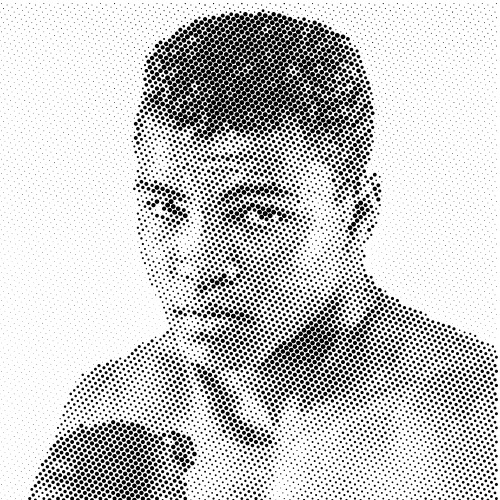

# Drawbot Halftone



This is an evolution of my own [basic halftone effect](https://github.com/werls/basic-drawbot-halftone) using [Drawbot](https://www.drawbot.com/).

**Drawbot** is a macOS powerful tool for creating graphics and animations. It is a great tool for generative art and graphic design. This script uses Drawbot to create a halftone effect from an image.

## Installation

1. Clone this repository.

```bash
git clone https://github.com/werls/drawbot-halftone.git
```

2. Change to the repository directory.

```bash
cd drawbot-halftone
```

3. Install the requirements.

```bash
pip install -r requirements.txt
```

4. Run the script.

```bash
python drawbot_halftone.py --path /path/to/image.jpg
```

## Parameters

| Parameter       | Type    | Description                                      | Default |
|-----------------|---------|--------------------------------------------------|---------|
| --path          | string  | The path to the image file.                      | None    |
| --resolution    | int     | The resolution of the halftone grid.             | 100     |
| --contrast      | float   | The maximum size of the halftone dots.           | 1       |
| --angle         | float   | The angle of rotation for the halftone grid.     | 45      |
| --color         | string  | The color of the halftone dots.                  | 0,0,0,1 |
| --color_mode    | string  | The color mode of the halftone dots (rgba or cmyk). | rgba |
| --honeycomb     | bool    | Use a honeycomb grid instead of a square grid.   | True    |
| --reescale_image| bool    | Reescale the image to fit the canvas default size. | False |
| --inverse       | bool    | Invert the colors of the image.                  | False   |
| --save          | bool    | Save the image to a file in /output/ folder.     | True    |
| --preset        | string  | A JSON string or file path of settings for the halftone effect. | None |
| --verbose       | bool    | Print the settings of the halftone effect.       | True    |

## Presets

You can create a JSON file with the settings for the halftone effect. Here is an example:

```json
{
    "resolution": 100,
    "contrast": 1,
    "angle": 45,
    "color": "0,0,0,1",
    "color_mode": "rgba",
    "honeycomb": true,
    "reescale_image": false,
    "save": true
}
```

The preset file can be passed as a parameter to the script.

```bash
python drawbot_halftone.py --path /path/to/image.jpg --preset /path/to/preset.json
```

In the `/presets/` folder you can find some examples of preset files.

## Batch processing with presets

You can use the following command to process multiple images with the same preset. 

```bash
for file in folder/*; do python main.py --path "$file" --preset=presets/halftone-pc-portraits.json; done
```